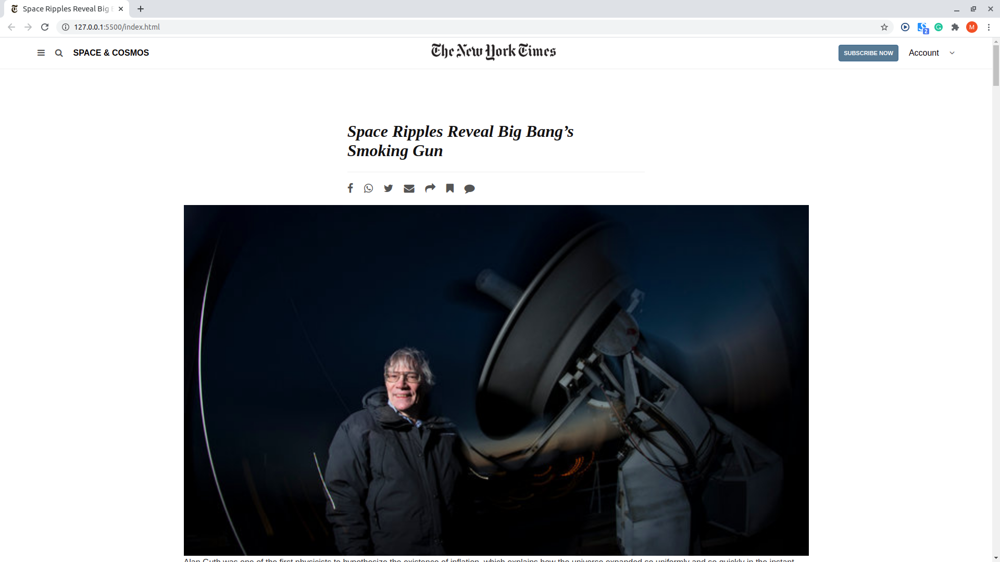

# New-York-Times

# Introduction to Project Sneak Peaks

> Positioning and Floating Elements

This assignment consists of making a clone of a New York Times article page

## Built With

- HTML
- CSS

## Live Demo

[Live Demo Link](x-special/nautilus-clipboard
copy
file:///home/moises/Pictures/Space%20Ripples%20Reveal%20Big%20Bang's%20Smoking%20Gun-The...%20-%20Google%20Chrome_001.png)

## Getting Started

**This is an example of how you may give instructions on setting up your project locally.**
**Modify this file to match your project, remove sections that don't apply. For example: delete the testing section if the currect project doesn't require testing.**

To get a local copy up and running follow these simple example steps.

## Authors

👤 **Author1**

- GitHub: (https://github.com/Mhdez221993)

- Twitter: (https://twitter.com/MoisesH42060050)

- LinkedIn:  (https://www.linkedin.com/in/moises-hernandez-9bbb17145/)

## 🤝 Contributing

Contributions, issues, and feature requests are welcome!

Feel free to check the [issues page](issues/).

## Show your support

Give a ⭐️ if you like this project!

## Acknowledgments

- Hat tip to anyone whose code was used
- Inspiration
- etc

## 📝 License

This project is [MIT](lic.url) licensed.
